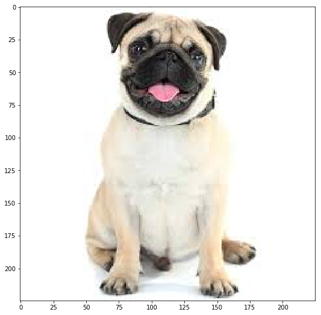
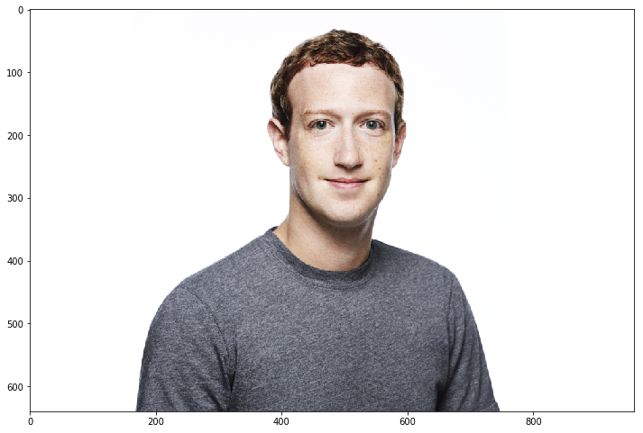
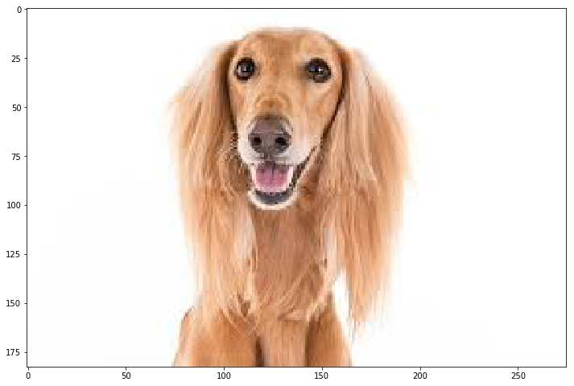
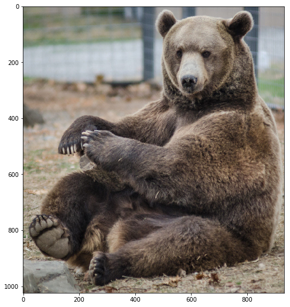
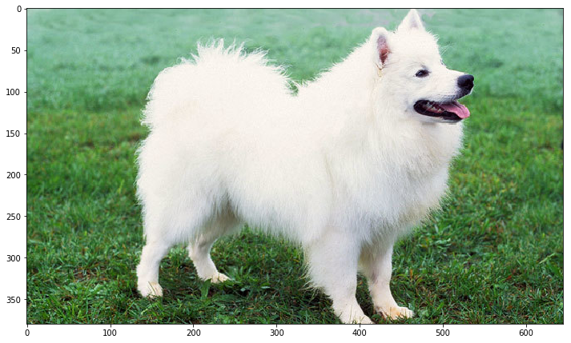
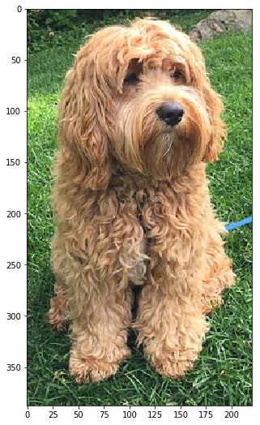
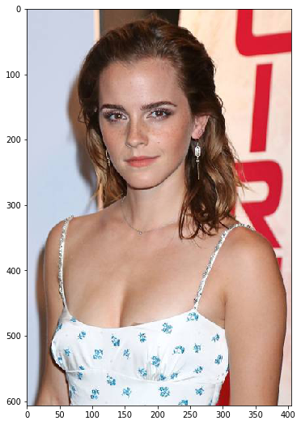
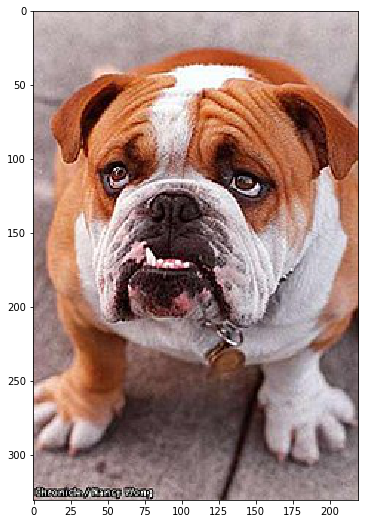

## Convolutional Neural Networks

## Project: Write an Algorithm for a Dog Identification App 

---
---
### Why We're Here 

In this notebook, you will make the first steps towards developing an algorithm that could be used as part of a mobile or web app.  At the end of this project, your code will accept any user-supplied image as input.  If a dog is detected in the image, it will provide an estimate of the dog's breed.  If a human is detected, it will provide an estimate of the dog breed that is most resembling.  The image below displays potential sample output of your finished project (... but we expect that each student's algorithm will behave differently!). 


In this real-world setting, you will need to piece together a series of models to perform different tasks; for instance, the algorithm that detects humans in an image will be different from the CNN that infers dog breed.  There are many points of possible failure, and no perfect algorithm exists.  Your imperfect solution will nonetheless create a fun user experience!

### The Road Ahead

We break the notebook into separate steps.  Feel free to use the links below to navigate the notebook.

* [Step 0](#step0): Import Datasets
* [Step 1](#step1): Detect Humans
* [Step 2](#step2): Detect Dogs
* [Step 3](#step3): Create a CNN to Classify Dog Breeds (from Scratch)
* [Step 4](#step4): Use a CNN to Classify Dog Breeds (using Transfer Learning)
* [Step 5](#step5): Create a CNN to Classify Dog Breeds (using Transfer Learning)
* [Step 6](#step6): Write your Algorithm
* [Step 7](#step7): Test Your Algorithm

---
<a id='step0'></a>
## Step 0: Import Datasets

### Import Dog Dataset

In the code cell below, we import a dataset of dog images.  We populate a few variables through the use of the `load_files` function from the scikit-learn library:
- `train_files`, `valid_files`, `test_files` - numpy arrays containing file paths to images
- `train_targets`, `valid_targets`, `test_targets` - numpy arrays containing onehot-encoded classification labels 
- `dog_names` - list of string-valued dog breed names for translating labels


```python
from sklearn.datasets import load_files       
from keras.utils import np_utils
import numpy as np
from glob import glob

# define function to load train, test, and validation datasets
def load_dataset(path):
    data = load_files(path)
    dog_files = np.array(data['filenames'])
    dog_targets = np_utils.to_categorical(np.array(data['target']), 133)
    return dog_files, dog_targets

# load train, test, and validation datasets
train_files, train_targets = load_dataset('/data/dog_images/train')
valid_files, valid_targets = load_dataset('/data/dog_images/valid')
test_files, test_targets = load_dataset('/data/dog_images/test')

# load list of dog names
dog_names = [item[20:-1] for item in sorted(glob("/data/dog_images/train/*/"))]

# print statistics about the dataset
print('There are %d total dog categories.' % len(dog_names))
print('There are %s total dog images.\n' % len(np.hstack([train_files, valid_files, test_files])))
print('There are %d training dog images.' % len(train_files))
print('There are %d validation dog images.' % len(valid_files))
print('There are %d test dog images.'% len(test_files))
```

    Using TensorFlow backend.


    There are 133 total dog categories.
    There are 8351 total dog images.
    
    There are 6680 training dog images.
    There are 835 validation dog images.
    There are 836 test dog images.


### Import Human Dataset

In the code cell below, we import a dataset of human images, where the file paths are stored in the numpy array `human_files`.


```python
import random
random.seed(8675309)

# load filenames in shuffled human dataset
human_files = np.array(glob("/data/lfw/*/*"))
random.shuffle(human_files)

# print statistics about the dataset
print('There are %d total human images.' % len(human_files))
```

    There are 13233 total human images.


---
<a id='step1'></a>
## Step 1: Detect Humans

We use OpenCV's implementation of [Haar feature-based cascade classifiers](http://docs.opencv.org/trunk/d7/d8b/tutorial_py_face_detection.html) to detect human faces in images.  OpenCV provides many pre-trained face detectors, stored as XML files on [github](https://github.com/opencv/opencv/tree/master/data/haarcascades).  We have downloaded one of these detectors and stored it in the `haarcascades` directory.

In the next code cell, we demonstrate how to use this detector to find human faces in a sample image.


```python
import cv2                
import matplotlib.pyplot as plt                        
%matplotlib inline                               

# extract pre-trained face detector
face_cascade = cv2.CascadeClassifier('haarcascades/haarcascade_frontalface_alt.xml')

# load color (BGR) image
img = cv2.imread(human_files[3])
# convert BGR image to grayscale
gray = cv2.cvtColor(img, cv2.COLOR_BGR2GRAY)

# find faces in image
faces = face_cascade.detectMultiScale(gray)

# print number of faces detected in the image
print('Number of faces detected:', len(faces))

# get bounding box for each detected face
for (x,y,w,h) in faces:
    # add bounding box to color image
    cv2.rectangle(img,(x,y),(x+w,y+h),(255,0,0),2)
    
# convert BGR image to RGB for plotting
cv_rgb = cv2.cvtColor(img, cv2.COLOR_BGR2RGB)

# display the image, along with bounding box
plt.imshow(cv_rgb)
plt.show()
```

    Number of faces detected: 1


Before using any of the face detectors, it is standard procedure to convert the images to grayscale.  The `detectMultiScale` function executes the classifier stored in `face_cascade` and takes the grayscale image as a parameter.  

In the above code, `faces` is a numpy array of detected faces, where each row corresponds to a detected face.  Each detected face is a 1D array with four entries that specifies the bounding box of the detected face.  The first two entries in the array (extracted in the above code as `x` and `y`) specify the horizontal and vertical positions of the top left corner of the bounding box.  The last two entries in the array (extracted here as `w` and `h`) specify the width and height of the box.

### Write a Human Face Detector

We can use this procedure to write a function that returns `True` if a human face is detected in an image and `False` otherwise.  This function, aptly named `face_detector`, takes a string-valued file path to an image as input and appears in the code block below.


```python
# returns "True" if face is detected in image stored at img_path
def face_detector(img_path):
    img = cv2.imread(img_path)
    gray = cv2.cvtColor(img, cv2.COLOR_BGR2GRAY)
    faces = face_cascade.detectMultiScale(gray)
    return len(faces) > 0
```

### (IMPLEMENTATION) Assess the Human Face Detector

__Question 1:__ Use the code cell below to test the performance of the `face_detector` function.  
- What percentage of the first 100 images in `human_files` have a detected human face?  
- What percentage of the first 100 images in `dog_files` have a detected human face? 

Ideally, we would like 100% of human images with a detected face and 0% of dog images with a detected face.  You will see that our algorithm falls short of this goal, but still gives acceptable performance.  We extract the file paths for the first 100 images from each of the datasets and store them in the numpy arrays `human_files_short` and `dog_files_short`.

__Answer:__ 


```python
human_files_short = human_files[:100]
dog_files_short = train_files[:100]

##Test the performance of the face_detector algorithm 
## on the images in human_files_short and dog_files_short.

humans = 0 
for human in human_files_short:
    if face_detector(human) == True:
        humans += 1   
dogs = 0
for dog in dog_files_short:
    if face_detector(dog) == True:
        dogs += 1
```


```python
print('{} imges of humans were detected humans.' .format(humans))
print('{} imges of dogs were detected as humans.' .format(dogs))
```

    100 imges of humans were detected humans.
    11 imges of dogs were detected as humans.


__Question 2:__ This algorithmic choice necessitates that we communicate to the user that we accept human images only when they provide a clear view of a face (otherwise, we risk having unneccessarily frustrated users!). In your opinion, is this a reasonable expectation to pose on the user? If not, can you think of a way to detect humans in images that does not necessitate an image with a clearly presented face?

__Answer:__

Asking user to only provide a clear view of a face is not acceptable and not user-friendly. Thus, we should build the algorithm based on CNN and we can use image augmentation to feed the algorithm. This will help to avoid the risk mentioned above.  


---
<a id='step2'></a>
## Step 2: Detect Dogs

In this section, we use a pre-trained [ResNet-50](http://ethereon.github.io/netscope/#/gist/db945b393d40bfa26006) model to detect dogs in images.  Our first line of code downloads the ResNet-50 model, along with weights that have been trained on [ImageNet](http://www.image-net.org/), a very large, very popular dataset used for image classification and other vision tasks.  ImageNet contains over 10 million URLs, each linking to an image containing an object from one of [1000 categories](https://gist.github.com/yrevar/942d3a0ac09ec9e5eb3a).  Given an image, this pre-trained ResNet-50 model returns a prediction (derived from the available categories in ImageNet) for the object that is contained in the image.


```python
from keras.applications.resnet50 import ResNet50

# define ResNet50 model
ResNet50_model = ResNet50(weights='imagenet')
```

    Downloading data from https://github.com/fchollet/deep-learning-models/releases/download/v0.2/resnet50_weights_tf_dim_ordering_tf_kernels.h5
    102858752/102853048 [==============================] - 1s 0us/step


### Pre-process the Data

When using TensorFlow as backend, Keras CNNs require a 4D array (which we'll also refer to as a 4D tensor) as input, with shape

$$
(\text{nb_samples}, \text{rows}, \text{columns}, \text{channels}),
$$

where `nb_samples` corresponds to the total number of images (or samples), and `rows`, `columns`, and `channels` correspond to the number of rows, columns, and channels for each image, respectively.  

The `path_to_tensor` function below takes a string-valued file path to a color image as input and returns a 4D tensor suitable for supplying to a Keras CNN.  The function first loads the image and resizes it to a square image that is $224 \times 224$ pixels.  Next, the image is converted to an array, which is then resized to a 4D tensor.  In this case, since we are working with color images, each image has three channels.  Likewise, since we are processing a single image (or sample), the returned tensor will always have shape

$$
(1, 224, 224, 3).
$$

The `paths_to_tensor` function takes a numpy array of string-valued image paths as input and returns a 4D tensor with shape 

$$
(\text{nb_samples}, 224, 224, 3).
$$

Here, `nb_samples` is the number of samples, or number of images, in the supplied array of image paths.  It is best to think of `nb_samples` as the number of 3D tensors (where each 3D tensor corresponds to a different image) in your dataset!


```python
from keras.preprocessing import image                  
from tqdm import tqdm

def path_to_tensor(img_path):
    # loads RGB image as PIL.Image.Image type
    img = image.load_img(img_path, target_size=(224, 224))
    # convert PIL.Image.Image type to 3D tensor with shape (224, 224, 3)
    x = image.img_to_array(img)
    # convert 3D tensor to 4D tensor with shape (1, 224, 224, 3) and return 4D tensor
    return np.expand_dims(x, axis=0)

def paths_to_tensor(img_paths):
    list_of_tensors = [path_to_tensor(img_path) for img_path in tqdm(img_paths)]
    return np.vstack(list_of_tensors)
```

### Making Predictions with ResNet-50

Getting the 4D tensor ready for ResNet-50, and for any other pre-trained model in Keras, requires some additional processing.  First, the RGB image is converted to BGR by reordering the channels.  All pre-trained models have the additional normalization step that the mean pixel (expressed in RGB as $[103.939, 116.779, 123.68]$ and calculated from all pixels in all images in ImageNet) must be subtracted from every pixel in each image.  This is implemented in the imported function `preprocess_input`.  If you're curious, you can check the code for `preprocess_input` [here](https://github.com/fchollet/keras/blob/master/keras/applications/imagenet_utils.py).

Now that we have a way to format our image for supplying to ResNet-50, we are now ready to use the model to extract the predictions.  This is accomplished with the `predict` method, which returns an array whose $i$-th entry is the model's predicted probability that the image belongs to the $i$-th ImageNet category.  This is implemented in the `ResNet50_predict_labels` function below.

By taking the argmax of the predicted probability vector, we obtain an integer corresponding to the model's predicted object class, which we can identify with an object category through the use of this [dictionary](https://gist.github.com/yrevar/942d3a0ac09ec9e5eb3a). 


```python
from keras.applications.resnet50 import preprocess_input, decode_predictions

def ResNet50_predict_labels(img_path):
    # returns prediction vector for image located at img_path
    img = preprocess_input(path_to_tensor(img_path))
    return np.argmax(ResNet50_model.predict(img))
```

### Write a Dog Detector

While looking at the [dictionary](https://gist.github.com/yrevar/942d3a0ac09ec9e5eb3a), you will notice that the categories corresponding to dogs appear in an uninterrupted sequence and correspond to dictionary keys 151-268, inclusive, to include all categories from `'Chihuahua'` to `'Mexican hairless'`.  Thus, in order to check to see if an image is predicted to contain a dog by the pre-trained ResNet-50 model, we need only check if the `ResNet50_predict_labels` function above returns a value between 151 and 268 (inclusive).

We use these ideas to complete the `dog_detector` function below, which returns `True` if a dog is detected in an image (and `False` if not).


```python
### returns "True" if a dog is detected in the image stored at img_path
def dog_detector(img_path):
    prediction = ResNet50_predict_labels(img_path)
    return ((prediction <= 268) & (prediction >= 151)) 
```

### (IMPLEMENTATION) Assess the Dog Detector

__Question 3:__ Use the code cell below to test the performance of your `dog_detector` function.  
- What percentage of the images in `human_files_short` have a detected dog?  
- What percentage of the images in `dog_files_short` have a detected dog?

__Answer:__ 


```python
### Test the performance of the dog_detector function
### on the images in human_files_short and dog_files_short.

humans = 0 
dogs = 0
for human in human_files_short:
    if dog_detector(human) == True:
        humans += 1        
for dog in dog_files_short:
    if dog_detector(dog) == True:
        dogs += 1
```


```python
print('{} imges of humans were detected dogs.' .format(humans))
print('{} imges of dogs were detected as dogs.' .format(dogs))
```

    0 imges of humans were detected dogs.
    100 imges of dogs were detected as dogs.


---
<a id='step3'></a>
## Step 3: Create a CNN to Classify Dog Breeds (from Scratch)

Now that we have functions for detecting humans and dogs in images, we need a way to predict breed from images.  In this step, you will create a CNN that classifies dog breeds.  You must create your CNN _from scratch_ (so, you can't use transfer learning _yet_!), and you must attain a test accuracy of at least 1%.  In Step 5 of this notebook, you will have the opportunity to use transfer learning to create a CNN that attains greatly improved accuracy.

Be careful with adding too many trainable layers!  More parameters means longer training, which means you are more likely to need a GPU to accelerate the training process.  Thankfully, Keras provides a handy estimate of the time that each epoch is likely to take; you can extrapolate this estimate to figure out how long it will take for your algorithm to train. 

We mention that the task of assigning breed to dogs from images is considered exceptionally challenging.  To see why, consider that *even a human* would have great difficulty in distinguishing between a Brittany and a Welsh Springer Spaniel.  

Brittany | Welsh Springer Spaniel
- | - 
 | 

It is not difficult to find other dog breed pairs with minimal inter-class variation (for instance, Curly-Coated Retrievers and American Water Spaniels).  

Curly-Coated Retriever | American Water Spaniel
- | -
 | 


Likewise, recall that labradors come in yellow, chocolate, and black.  Your vision-based algorithm will have to conquer this high intra-class variation to determine how to classify all of these different shades as the same breed.  

Yellow Labrador | Chocolate Labrador | Black Labrador
- | -
 |  | 

We also mention that random chance presents an exceptionally low bar: setting aside the fact that the classes are slightly imabalanced, a random guess will provide a correct answer roughly 1 in 133 times, which corresponds to an accuracy of less than 1%.  

Remember that the practice is far ahead of the theory in deep learning.  Experiment with many different architectures, and trust your intuition.  And, of course, have fun! 

### Pre-process the Data

We rescale the images by dividing every pixel in every image by 255.


```python
from PIL import ImageFile                            
ImageFile.LOAD_TRUNCATED_IMAGES = True                 

# pre-process the data for Keras
train_tensors = paths_to_tensor(train_files).astype('float32')/255
valid_tensors = paths_to_tensor(valid_files).astype('float32')/255
test_tensors = paths_to_tensor(test_files).astype('float32')/255
```

    100%|██████████| 6680/6680 [01:27<00:00, 49.36it/s] 
    100%|██████████| 835/835 [00:09<00:00, 84.31it/s] 
    100%|██████████| 836/836 [00:09<00:00, 85.11it/s] 


### (IMPLEMENTATION) Model Architecture

Create a CNN to classify dog breed.  At the end of your code cell block, summarize the layers of your model by executing the line:
    
        model.summary()

We have imported some Python modules to get you started, but feel free to import as many modules as you need.  If you end up getting stuck, here's a hint that specifies a model that trains relatively fast on CPU and attains >1% test accuracy in 5 epochs:


           
__Question 4:__ Outline the steps you took to get to your final CNN architecture and your reasoning at each step.  If you chose to use the hinted architecture above, describe why you think that CNN architecture should work well for the image classification task.

__Answer:__ 

The CNN architecture bellow are based on the hinted architecture.
First, I added one more layer of Conv2D with 128 filters, as well as MaxPooling2D layer. The accurecy was 8.8517%, then I added another layer of Conv2D with 256 filters and a MaxPooling2D layer. This yeilds to 18.3014% accurecy. I added dropout layers and I the accurecy decreased to 10.9%. So the final architecture is as following: 
1. Conv2D layer with 16 filters followed by MaxPooling2D with size 2 using relu as an activation function 
2. same as the above but with 32 filters 
3. same as the above but with 64 filters 
4. same as the above but with 128 filters 
5. same as the above but with 256 filters 
6. a GlobalAveragePooling2D layer to reduce dimentionality 
7. softmax activation as an output layer


```python
from keras.layers import Conv2D, MaxPooling2D, GlobalAveragePooling2D
from keras.layers import Dropout, Flatten, Dense
from keras.models import Sequential

model = Sequential()

model.add(Conv2D(filters=16, kernel_size=2, padding='same', activation='relu', input_shape=(224, 224, 3)))
model.add(MaxPooling2D(pool_size=2))
model.add(Conv2D(filters=32, kernel_size=2, padding='same', activation='relu'))
model.add(MaxPooling2D(pool_size=2))
model.add(Conv2D(filters=64, kernel_size=2, padding='same', activation='relu'))
model.add(MaxPooling2D(pool_size=2))
model.add(Conv2D(filters=128, kernel_size=2, padding='same', activation='relu'))
model.add(MaxPooling2D(pool_size=2))
model.add(Conv2D(filters=256, kernel_size=2, padding='same', activation='relu'))
model.add(MaxPooling2D(pool_size=2))
model.add(GlobalAveragePooling2D(data_format=None))
model.add(Dense(133, activation='softmax'))

model.summary()
```

    _________________________________________________________________
    Layer (type)                 Output Shape              Param #   
    =================================================================
    conv2d_6 (Conv2D)            (None, 224, 224, 16)      208       
    _________________________________________________________________
    max_pooling2d_7 (MaxPooling2 (None, 112, 112, 16)      0         
    _________________________________________________________________
    conv2d_7 (Conv2D)            (None, 112, 112, 32)      2080      
    _________________________________________________________________
    max_pooling2d_8 (MaxPooling2 (None, 56, 56, 32)        0         
    _________________________________________________________________
    conv2d_8 (Conv2D)            (None, 56, 56, 64)        8256      
    _________________________________________________________________
    max_pooling2d_9 (MaxPooling2 (None, 28, 28, 64)        0         
    _________________________________________________________________
    conv2d_9 (Conv2D)            (None, 28, 28, 128)       32896     
    _________________________________________________________________
    max_pooling2d_10 (MaxPooling (None, 14, 14, 128)       0         
    _________________________________________________________________
    conv2d_10 (Conv2D)           (None, 14, 14, 256)       131328    
    _________________________________________________________________
    max_pooling2d_11 (MaxPooling (None, 7, 7, 256)         0         
    _________________________________________________________________
    global_average_pooling2d_2 ( (None, 256)               0         
    _________________________________________________________________
    dense_2 (Dense)              (None, 133)               34181     
    =================================================================
    Total params: 208,949
    Trainable params: 208,949
    Non-trainable params: 0
    _________________________________________________________________


### Compile the Model


```python
model.compile(optimizer='rmsprop', loss='categorical_crossentropy', metrics=['accuracy'])
```

### (IMPLEMENTATION) Train the Model

Train your model in the code cell below.  Use model checkpointing to save the model that attains the best validation loss.

You are welcome to [augment the training data](https://blog.keras.io/building-powerful-image-classification-models-using-very-little-data.html), but this is not a requirement. 


```python
from keras.callbacks import ModelCheckpoint  

### the number of epochs that you would like to use to train the model.

epochs = 20

### Do NOT modify the code below this line.

checkpointer = ModelCheckpoint(filepath='saved_models/weights.best.from_scratch.hdf5', 
                               verbose=1, save_best_only=True)

model.fit(train_tensors, train_targets, 
          validation_data=(valid_tensors, valid_targets),
          epochs=epochs, batch_size=20, callbacks=[checkpointer], verbose=1)
```

    Train on 6680 samples, validate on 835 samples
    Epoch 1/20
    6660/6680 [============================>.] - ETA: 0s - loss: 3.2170 - acc: 0.2210Epoch 00001: val_loss improved from inf to 3.85384, saving model to saved_models/weights.best.from_scratch.hdf5
    6680/6680 [==============================] - 25s 4ms/step - loss: 3.2170 - acc: 0.2213 - val_loss: 3.8538 - val_acc: 0.1401
    Epoch 2/20
    6660/6680 [============================>.] - ETA: 0s - loss: 3.1584 - acc: 0.2324Epoch 00002: val_loss improved from 3.85384 to 3.73640, saving model to saved_models/weights.best.from_scratch.hdf5
    6680/6680 [==============================] - 25s 4ms/step - loss: 3.1601 - acc: 0.2322 - val_loss: 3.7364 - val_acc: 0.1413
    Epoch 3/20
    6660/6680 [============================>.] - ETA: 0s - loss: 3.0935 - acc: 0.2461Epoch 00003: val_loss improved from 3.73640 to 3.63292, saving model to saved_models/weights.best.from_scratch.hdf5
    6680/6680 [==============================] - 25s 4ms/step - loss: 3.0964 - acc: 0.2457 - val_loss: 3.6329 - val_acc: 0.1281
    Epoch 4/20
    6660/6680 [============================>.] - ETA: 0s - loss: 3.0184 - acc: 0.2568Epoch 00004: val_loss improved from 3.63292 to 3.53573, saving model to saved_models/weights.best.from_scratch.hdf5
    6680/6680 [==============================] - 25s 4ms/step - loss: 3.0199 - acc: 0.2564 - val_loss: 3.5357 - val_acc: 0.1617
    Epoch 5/20
    6660/6680 [============================>.] - ETA: 0s - loss: 2.9514 - acc: 0.2667Epoch 00005: val_loss improved from 3.53573 to 3.52454, saving model to saved_models/weights.best.from_scratch.hdf5
    6680/6680 [==============================] - 25s 4ms/step - loss: 2.9508 - acc: 0.2668 - val_loss: 3.5245 - val_acc: 0.1689
    Epoch 6/20
    6660/6680 [============================>.] - ETA: 0s - loss: 2.9041 - acc: 0.2755Epoch 00006: val_loss did not improve
    6680/6680 [==============================] - 25s 4ms/step - loss: 2.9033 - acc: 0.2757 - val_loss: 3.6918 - val_acc: 0.1629
    Epoch 7/20
    6660/6680 [============================>.] - ETA: 0s - loss: 2.8355 - acc: 0.2937Epoch 00007: val_loss did not improve
    6680/6680 [==============================] - 25s 4ms/step - loss: 2.8371 - acc: 0.2936 - val_loss: 3.5920 - val_acc: 0.1677
    Epoch 8/20
    6660/6680 [============================>.] - ETA: 0s - loss: 2.7771 - acc: 0.3008Epoch 00008: val_loss did not improve
    6680/6680 [==============================] - 25s 4ms/step - loss: 2.7767 - acc: 0.3006 - val_loss: 3.5632 - val_acc: 0.1856
    Epoch 9/20
    6660/6680 [============================>.] - ETA: 0s - loss: 2.7165 - acc: 0.3156Epoch 00009: val_loss did not improve
    6680/6680 [==============================] - 25s 4ms/step - loss: 2.7166 - acc: 0.3159 - val_loss: 3.6204 - val_acc: 0.1641
    Epoch 10/20
    6660/6680 [============================>.] - ETA: 0s - loss: 2.6536 - acc: 0.3342Epoch 00010: val_loss improved from 3.52454 to 3.42847, saving model to saved_models/weights.best.from_scratch.hdf5
    6680/6680 [==============================] - 25s 4ms/step - loss: 2.6537 - acc: 0.3343 - val_loss: 3.4285 - val_acc: 0.1832
    Epoch 11/20
    6660/6680 [============================>.] - ETA: 0s - loss: 2.5937 - acc: 0.3461Epoch 00011: val_loss did not improve
    6680/6680 [==============================] - 25s 4ms/step - loss: 2.5957 - acc: 0.3460 - val_loss: 3.5264 - val_acc: 0.1916
    Epoch 12/20
    6660/6680 [============================>.] - ETA: 0s - loss: 2.5213 - acc: 0.3614Epoch 00012: val_loss did not improve
    6680/6680 [==============================] - 25s 4ms/step - loss: 2.5217 - acc: 0.3618 - val_loss: 3.5546 - val_acc: 0.1832
    Epoch 13/20
    6660/6680 [============================>.] - ETA: 0s - loss: 2.4574 - acc: 0.3763Epoch 00013: val_loss did not improve
    6680/6680 [==============================] - 25s 4ms/step - loss: 2.4583 - acc: 0.3763 - val_loss: 4.3956 - val_acc: 0.1796
    Epoch 14/20
    6660/6680 [============================>.] - ETA: 0s - loss: 2.4017 - acc: 0.3878Epoch 00014: val_loss did not improve
    6680/6680 [==============================] - 25s 4ms/step - loss: 2.4015 - acc: 0.3879 - val_loss: 3.7599 - val_acc: 0.1940
    Epoch 15/20
    6660/6680 [============================>.] - ETA: 0s - loss: 2.3514 - acc: 0.3974Epoch 00015: val_loss did not improve
    6680/6680 [==============================] - 25s 4ms/step - loss: 2.3494 - acc: 0.3976 - val_loss: 3.5122 - val_acc: 0.2048
    Epoch 16/20
    6660/6680 [============================>.] - ETA: 0s - loss: 2.2703 - acc: 0.4168Epoch 00016: val_loss did not improve
    6680/6680 [==============================] - 25s 4ms/step - loss: 2.2695 - acc: 0.4165 - val_loss: 3.5044 - val_acc: 0.2024
    Epoch 17/20
    6660/6680 [============================>.] - ETA: 0s - loss: 2.2046 - acc: 0.4291Epoch 00017: val_loss did not improve
    6680/6680 [==============================] - 25s 4ms/step - loss: 2.2030 - acc: 0.4295 - val_loss: 3.5613 - val_acc: 0.2000
    Epoch 18/20
    6660/6680 [============================>.] - ETA: 0s - loss: 2.1535 - acc: 0.4420Epoch 00018: val_loss did not improve
    6680/6680 [==============================] - 25s 4ms/step - loss: 2.1527 - acc: 0.4418 - val_loss: 3.7892 - val_acc: 0.1916
    Epoch 19/20
    6660/6680 [============================>.] - ETA: 0s - loss: 2.0877 - acc: 0.4512Epoch 00019: val_loss did not improve
    6680/6680 [==============================] - 25s 4ms/step - loss: 2.0873 - acc: 0.4512 - val_loss: 3.6226 - val_acc: 0.2024
    Epoch 20/20
    6660/6680 [============================>.] - ETA: 0s - loss: 2.0161 - acc: 0.4674Epoch 00020: val_loss did not improve
    6680/6680 [==============================] - 25s 4ms/step - loss: 2.0147 - acc: 0.4680 - val_loss: 3.6618 - val_acc: 0.2120


    <keras.callbacks.History at 0x7fc0306d8860>


### Load the Model with the Best Validation Loss


```python
model.load_weights('saved_models/weights.best.from_scratch.hdf5')
```

### Test the Model

Try out your model on the test dataset of dog images.  Ensure that your test accuracy is greater than 1%.


```python
# get index of predicted dog breed for each image in test set
dog_breed_predictions = [np.argmax(model.predict(np.expand_dims(tensor, axis=0))) for tensor in test_tensors]

# report test accuracy
test_accuracy = 100*np.sum(np.array(dog_breed_predictions)==np.argmax(test_targets, axis=1))/len(dog_breed_predictions)
print('Test accuracy: %.4f%%' % test_accuracy)
```

    Test accuracy: 18.3014%


---
<a id='step4'></a>
## Step 4: Use a CNN to Classify Dog Breeds

To reduce training time without sacrificing accuracy, we show you how to train a CNN using transfer learning.  In the following step, you will get a chance to use transfer learning to train your own CNN.

### Obtain Bottleneck Features


```python
bottleneck_features = np.load('/data/bottleneck_features/DogVGG16Data.npz')
train_VGG16 = bottleneck_features['train']
valid_VGG16 = bottleneck_features['valid']
test_VGG16 = bottleneck_features['test']
```

### Model Architecture

The model uses the the pre-trained VGG-16 model as a fixed feature extractor, where the last convolutional output of VGG-16 is fed as input to our model.  We only add a global average pooling layer and a fully connected layer, where the latter contains one node for each dog category and is equipped with a softmax.


```python
VGG16_model = Sequential()
VGG16_model.add(GlobalAveragePooling2D(input_shape=train_VGG16.shape[1:]))
VGG16_model.add(Dense(133, activation='softmax'))

VGG16_model.summary()
```

    _________________________________________________________________
    Layer (type)                 Output Shape              Param #   
    =================================================================
    global_average_pooling2d_3 ( (None, 512)               0         
    _________________________________________________________________
    dense_3 (Dense)              (None, 133)               68229     
    =================================================================
    Total params: 68,229
    Trainable params: 68,229
    Non-trainable params: 0
    _________________________________________________________________


### Compile the Model


```python
VGG16_model.compile(loss='categorical_crossentropy', optimizer='rmsprop', metrics=['accuracy'])
```

### Train the Model


```python
checkpointer = ModelCheckpoint(filepath='saved_models/weights.best.VGG16.hdf5', 
                               verbose=1, save_best_only=True)

VGG16_model.fit(train_VGG16, train_targets, 
          validation_data=(valid_VGG16, valid_targets),
          epochs=20, batch_size=20, callbacks=[checkpointer], verbose=1)
```

    Train on 6680 samples, validate on 835 samples
    Epoch 1/20
    6480/6680 [============================>.] - ETA: 0s - loss: 12.6775 - acc: 0.1142Epoch 00001: val_loss improved from inf to 11.48148, saving model to saved_models/weights.best.VGG16.hdf5
    6680/6680 [==============================] - 2s 313us/step - loss: 12.6332 - acc: 0.1166 - val_loss: 11.4815 - val_acc: 0.1928
    Epoch 2/20
    6520/6680 [============================>.] - ETA: 0s - loss: 10.6669 - acc: 0.2661Epoch 00002: val_loss improved from 11.48148 to 10.76274, saving model to saved_models/weights.best.VGG16.hdf5
    6680/6680 [==============================] - 2s 271us/step - loss: 10.6622 - acc: 0.2663 - val_loss: 10.7627 - val_acc: 0.2563
    Epoch 3/20
    6620/6680 [============================>.] - ETA: 0s - loss: 10.2146 - acc: 0.3202Epoch 00003: val_loss improved from 10.76274 to 10.40196, saving model to saved_models/weights.best.VGG16.hdf5
    6680/6680 [==============================] - 2s 259us/step - loss: 10.2235 - acc: 0.3199 - val_loss: 10.4020 - val_acc: 0.2850
    Epoch 4/20
    6460/6680 [============================>.] - ETA: 0s - loss: 10.0456 - acc: 0.3480Epoch 00004: val_loss improved from 10.40196 to 10.33139, saving model to saved_models/weights.best.VGG16.hdf5
    6680/6680 [==============================] - 2s 255us/step - loss: 10.0648 - acc: 0.3464 - val_loss: 10.3314 - val_acc: 0.3018
    Epoch 5/20
    6640/6680 [============================>.] - ETA: 0s - loss: 9.9472 - acc: 0.3592Epoch 00005: val_loss improved from 10.33139 to 10.20867, saving model to saved_models/weights.best.VGG16.hdf5
    6680/6680 [==============================] - 2s 258us/step - loss: 9.9481 - acc: 0.3593 - val_loss: 10.2087 - val_acc: 0.3198
    Epoch 6/20
    6580/6680 [============================>.] - ETA: 0s - loss: 9.8481 - acc: 0.3725Epoch 00006: val_loss improved from 10.20867 to 10.14537, saving model to saved_models/weights.best.VGG16.hdf5
    6680/6680 [==============================] - 2s 261us/step - loss: 9.8513 - acc: 0.3725 - val_loss: 10.1454 - val_acc: 0.3234
    Epoch 7/20
    6640/6680 [============================>.] - ETA: 0s - loss: 9.8182 - acc: 0.3798Epoch 00007: val_loss did not improve
    6680/6680 [==============================] - 2s 258us/step - loss: 9.8125 - acc: 0.3802 - val_loss: 10.2027 - val_acc: 0.3126
    Epoch 8/20
    6620/6680 [============================>.] - ETA: 0s - loss: 9.7917 - acc: 0.3875Epoch 00008: val_loss did not improve
    6680/6680 [==============================] - 2s 256us/step - loss: 9.7931 - acc: 0.3874 - val_loss: 10.1830 - val_acc: 0.3234
    Epoch 9/20
    6580/6680 [============================>.] - ETA: 0s - loss: 9.6874 - acc: 0.3877Epoch 00009: val_loss improved from 10.14537 to 10.04163, saving model to saved_models/weights.best.VGG16.hdf5
    6680/6680 [==============================] - 2s 260us/step - loss: 9.6871 - acc: 0.3876 - val_loss: 10.0416 - val_acc: 0.3269
    Epoch 10/20
    6640/6680 [============================>.] - ETA: 0s - loss: 9.6154 - acc: 0.3947Epoch 00010: val_loss improved from 10.04163 to 9.94311, saving model to saved_models/weights.best.VGG16.hdf5
    6680/6680 [==============================] - 2s 259us/step - loss: 9.6079 - acc: 0.3952 - val_loss: 9.9431 - val_acc: 0.3377
    Epoch 11/20
    6480/6680 [============================>.] - ETA: 0s - loss: 9.5321 - acc: 0.3975Epoch 00011: val_loss improved from 9.94311 to 9.86674, saving model to saved_models/weights.best.VGG16.hdf5
    6680/6680 [==============================] - 2s 254us/step - loss: 9.5431 - acc: 0.3969 - val_loss: 9.8667 - val_acc: 0.3341
    Epoch 12/20
    6480/6680 [============================>.] - ETA: 0s - loss: 9.3702 - acc: 0.4032Epoch 00012: val_loss improved from 9.86674 to 9.65506, saving model to saved_models/weights.best.VGG16.hdf5
    6680/6680 [==============================] - 2s 255us/step - loss: 9.3754 - acc: 0.4028 - val_loss: 9.6551 - val_acc: 0.3305
    Epoch 13/20
    6460/6680 [============================>.] - ETA: 0s - loss: 9.1054 - acc: 0.4153Epoch 00013: val_loss improved from 9.65506 to 9.59554, saving model to saved_models/weights.best.VGG16.hdf5
    6680/6680 [==============================] - 2s 256us/step - loss: 9.0958 - acc: 0.4163 - val_loss: 9.5955 - val_acc: 0.3377
    Epoch 14/20
    6660/6680 [============================>.] - ETA: 0s - loss: 8.9904 - acc: 0.4279Epoch 00014: val_loss improved from 9.59554 to 9.48163, saving model to saved_models/weights.best.VGG16.hdf5
    6680/6680 [==============================] - 2s 258us/step - loss: 8.9951 - acc: 0.4275 - val_loss: 9.4816 - val_acc: 0.3557
    Epoch 15/20
    6500/6680 [============================>.] - ETA: 0s - loss: 8.9914 - acc: 0.4318Epoch 00015: val_loss improved from 9.48163 to 9.48080, saving model to saved_models/weights.best.VGG16.hdf5
    6680/6680 [==============================] - 2s 270us/step - loss: 8.9527 - acc: 0.4343 - val_loss: 9.4808 - val_acc: 0.3605
    Epoch 16/20
    6660/6680 [============================>.] - ETA: 0s - loss: 8.9373 - acc: 0.4386Epoch 00016: val_loss improved from 9.48080 to 9.46216, saving model to saved_models/weights.best.VGG16.hdf5
    6680/6680 [==============================] - 2s 267us/step - loss: 8.9375 - acc: 0.4385 - val_loss: 9.4622 - val_acc: 0.3653
    Epoch 17/20
    6580/6680 [============================>.] - ETA: 0s - loss: 8.9485 - acc: 0.4381Epoch 00017: val_loss improved from 9.46216 to 9.40572, saving model to saved_models/weights.best.VGG16.hdf5
    6680/6680 [==============================] - 2s 260us/step - loss: 8.9260 - acc: 0.4394 - val_loss: 9.4057 - val_acc: 0.3629
    Epoch 18/20
    6660/6680 [============================>.] - ETA: 0s - loss: 8.8906 - acc: 0.4417Epoch 00018: val_loss did not improve
    6680/6680 [==============================] - 2s 253us/step - loss: 8.8954 - acc: 0.4415 - val_loss: 9.4524 - val_acc: 0.3533
    Epoch 19/20
    6440/6680 [===========================>..] - ETA: 0s - loss: 8.8858 - acc: 0.4439Epoch 00019: val_loss improved from 9.40572 to 9.39413, saving model to saved_models/weights.best.VGG16.hdf5
    6680/6680 [==============================] - 2s 256us/step - loss: 8.8715 - acc: 0.4446 - val_loss: 9.3941 - val_acc: 0.3629
    Epoch 20/20
    6560/6680 [============================>.] - ETA: 0s - loss: 8.8445 - acc: 0.4471Epoch 00020: val_loss improved from 9.39413 to 9.34095, saving model to saved_models/weights.best.VGG16.hdf5
    6680/6680 [==============================] - 2s 261us/step - loss: 8.8581 - acc: 0.4463 - val_loss: 9.3409 - val_acc: 0.3749


    <keras.callbacks.History at 0x7faafc4296d8>


### Load the Model with the Best Validation Loss


```python
VGG16_model.load_weights('saved_models/weights.best.VGG16.hdf5')
```

### Test the Model

Now, we can use the CNN to test how well it identifies breed within our test dataset of dog images.  We print the test accuracy below.


```python
# get index of predicted dog breed for each image in test set
VGG16_predictions = [np.argmax(VGG16_model.predict(np.expand_dims(feature, axis=0))) for feature in test_VGG16]

# report test accuracy
test_accuracy = 100*np.sum(np.array(VGG16_predictions)==np.argmax(test_targets, axis=1))/len(VGG16_predictions)
print('Test accuracy: %.4f%%' % test_accuracy)
```

    Test accuracy: 36.3636%


### Predict Dog Breed with the Model


```python
from extract_bottleneck_features import *

def VGG16_predict_breed(img_path):
    # extract bottleneck features
    bottleneck_feature = extract_VGG16(path_to_tensor(img_path))
    # obtain predicted vector
    predicted_vector = VGG16_model.predict(bottleneck_feature)
    # return dog breed that is predicted by the model
    return dog_names[np.argmax(predicted_vector)]
```

---
<a id='step5'></a>
## Step 5: Create a CNN to Classify Dog Breeds (using Transfer Learning)

You will now use transfer learning to create a CNN that can identify dog breed from images.  Your CNN must attain at least 60% accuracy on the test set.

In Step 4, we used transfer learning to create a CNN using VGG-16 bottleneck features.  In this section, you must use the bottleneck features from a different pre-trained model.  To make things easier for you, we have pre-computed the features for all of the networks that are currently available in Keras.  These are already in the workspace, at /data/bottleneck_features.  If you wish to download them on a different machine, they can be found at:
- [VGG-19](https://s3-us-west-1.amazonaws.com/udacity-aind/dog-project/DogVGG19Data.npz) bottleneck features
- [ResNet-50](https://s3-us-west-1.amazonaws.com/udacity-aind/dog-project/DogResnet50Data.npz) bottleneck features
- [Inception](https://s3-us-west-1.amazonaws.com/udacity-aind/dog-project/DogInceptionV3Data.npz) bottleneck features
- [Xception](https://s3-us-west-1.amazonaws.com/udacity-aind/dog-project/DogXceptionData.npz) bottleneck features

The files are encoded as such:

    Dog{network}Data.npz
    
where `{network}`, in the above filename, can be one of `VGG19`, `Resnet50`, `InceptionV3`, or `Xception`.  

The above architectures are downloaded and stored for you in the `/data/bottleneck_features/` folder.

This means the following will be in the `/data/bottleneck_features/` folder:

`DogVGG19Data.npz`
`DogResnet50Data.npz`
`DogInceptionV3Data.npz`
`DogXceptionData.npz`


### (IMPLEMENTATION) Obtain Bottleneck Features

In the code block below, extract the bottleneck features corresponding to the train, test, and validation sets by running the following:

    bottleneck_features = np.load('/data/bottleneck_features/Dog{network}Data.npz')
    train_{network} = bottleneck_features['train']
    valid_{network} = bottleneck_features['valid']
    test_{network} = bottleneck_features['test']


```python
###bottleneck features from Resnet50 pre-trained CNN.
bottleneck_features = np.load('/data/bottleneck_features/DogResnet50Data.npz')
train_Resnet50 = bottleneck_features['train']
valid_Resnet50 = bottleneck_features['valid']
test_Resnet50 = bottleneck_features['test']
```

### (IMPLEMENTATION) Model Architecture

Create a CNN to classify dog breed.  At the end of your code cell block, summarize the layers of your model by executing the line:
    
        <your model's name>.summary()
   
__Question 5:__ Outline the steps you took to get to your final CNN architecture and your reasoning at each step.  Describe why you think the architecture is suitable for the current problem.

__Answer:__ 
I used the Resnet50 as a transfer learning model with 20 epoches and 20 batches. After obtaining the Bottleneck Features for the model, I added GlobalAveragePooling2D layer to reduce deminsinality and fully connected as an output layer with 133 nodes and using the softmax function. The test accuracy is 81.58% which is higher that VGG16 model. 


```python
###Define your architecture.

model_Resnet = Sequential()
model_Resnet.add(GlobalAveragePooling2D(input_shape=train_Resnet50.shape[1:]))
model_Resnet.add(Dense(133, activation='softmax'))
model_Resnet.summary()
```

    _________________________________________________________________
    Layer (type)                 Output Shape              Param #   
    =================================================================
    global_average_pooling2d_4 ( (None, 2048)              0         
    _________________________________________________________________
    dense_4 (Dense)              (None, 133)               272517    
    =================================================================
    Total params: 272,517
    Trainable params: 272,517
    Non-trainable params: 0
    _________________________________________________________________


### (IMPLEMENTATION) Compile the Model


```python
###Compile the model.
model_Resnet.compile(loss='categorical_crossentropy', optimizer='rmsprop', metrics=['accuracy'])
```

### (IMPLEMENTATION) Train the Model

Train your model in the code cell below.  Use model checkpointing to save the model that attains the best validation loss.  

You are welcome to [augment the training data](https://blog.keras.io/building-powerful-image-classification-models-using-very-little-data.html), but this is not a requirement. 


```python
###Train the model.
checkpointer = ModelCheckpoint(filepath='saved_models/weights.best.Resnet50.hdf5', 
                               verbose=1, save_best_only=True)

model_Resnet.fit(train_Resnet50, train_targets, 
          validation_data=(valid_Resnet50, valid_targets),
          epochs=20, batch_size=20, callbacks=[checkpointer], verbose=1)
```

    Train on 6680 samples, validate on 835 samples
    Epoch 1/20
    6620/6680 [============================>.] - ETA: 0s - loss: 1.6363 - acc: 0.5979Epoch 00001: val_loss improved from inf to 0.80119, saving model to saved_models/weights.best.Resnet50.hdf5
    6680/6680 [==============================] - 2s 316us/step - loss: 1.6306 - acc: 0.5984 - val_loss: 0.8012 - val_acc: 0.7461
    Epoch 2/20
    6480/6680 [============================>.] - ETA: 0s - loss: 0.4344 - acc: 0.8617Epoch 00002: val_loss improved from 0.80119 to 0.65653, saving model to saved_models/weights.best.Resnet50.hdf5
    6680/6680 [==============================] - 2s 227us/step - loss: 0.4339 - acc: 0.8614 - val_loss: 0.6565 - val_acc: 0.7952
    Epoch 3/20
    6460/6680 [============================>.] - ETA: 0s - loss: 0.2594 - acc: 0.9200Epoch 00003: val_loss improved from 0.65653 to 0.64499, saving model to saved_models/weights.best.Resnet50.hdf5
    6680/6680 [==============================] - 2s 229us/step - loss: 0.2623 - acc: 0.9189 - val_loss: 0.6450 - val_acc: 0.8096
    Epoch 4/20
    6620/6680 [============================>.] - ETA: 0s - loss: 0.1790 - acc: 0.9426Epoch 00004: val_loss did not improve
    6680/6680 [==============================] - 2s 227us/step - loss: 0.1812 - acc: 0.9418 - val_loss: 0.7068 - val_acc: 0.8000
    Epoch 5/20
    6580/6680 [============================>.] - ETA: 0s - loss: 0.1251 - acc: 0.9626Epoch 00005: val_loss improved from 0.64499 to 0.62804, saving model to saved_models/weights.best.Resnet50.hdf5
    6680/6680 [==============================] - 1s 224us/step - loss: 0.1242 - acc: 0.9629 - val_loss: 0.6280 - val_acc: 0.8048
    Epoch 6/20
    6560/6680 [============================>.] - ETA: 0s - loss: 0.0850 - acc: 0.9747Epoch 00006: val_loss did not improve
    6680/6680 [==============================] - 1s 222us/step - loss: 0.0850 - acc: 0.9746 - val_loss: 0.6821 - val_acc: 0.8240
    Epoch 7/20
    6500/6680 [============================>.] - ETA: 0s - loss: 0.0648 - acc: 0.9797Epoch 00007: val_loss did not improve
    6680/6680 [==============================] - 1s 223us/step - loss: 0.0643 - acc: 0.9798 - val_loss: 0.6839 - val_acc: 0.8144
    Epoch 8/20
    6660/6680 [============================>.] - ETA: 0s - loss: 0.0465 - acc: 0.9869Epoch 00008: val_loss did not improve
    6680/6680 [==============================] - 1s 221us/step - loss: 0.0466 - acc: 0.9868 - val_loss: 0.7286 - val_acc: 0.8228
    Epoch 9/20
    6520/6680 [============================>.] - ETA: 0s - loss: 0.0383 - acc: 0.9900Epoch 00009: val_loss did not improve
    6680/6680 [==============================] - 1s 223us/step - loss: 0.0388 - acc: 0.9897 - val_loss: 0.7552 - val_acc: 0.8180
    Epoch 10/20
    6520/6680 [============================>.] - ETA: 0s - loss: 0.0292 - acc: 0.9926Epoch 00010: val_loss did not improve
    6680/6680 [==============================] - 1s 224us/step - loss: 0.0294 - acc: 0.9924 - val_loss: 0.8108 - val_acc: 0.8072
    Epoch 11/20
    6540/6680 [============================>.] - ETA: 0s - loss: 0.0206 - acc: 0.9957Epoch 00011: val_loss did not improve
    6680/6680 [==============================] - 1s 223us/step - loss: 0.0207 - acc: 0.9955 - val_loss: 0.7516 - val_acc: 0.8228
    Epoch 12/20
    6600/6680 [============================>.] - ETA: 0s - loss: 0.0164 - acc: 0.9962Epoch 00012: val_loss did not improve
    6680/6680 [==============================] - 1s 222us/step - loss: 0.0167 - acc: 0.9961 - val_loss: 0.8414 - val_acc: 0.8180
    Epoch 13/20
    6480/6680 [============================>.] - ETA: 0s - loss: 0.0139 - acc: 0.9969Epoch 00013: val_loss did not improve
    6680/6680 [==============================] - 1s 224us/step - loss: 0.0147 - acc: 0.9964 - val_loss: 0.7921 - val_acc: 0.8204
    Epoch 14/20
    6660/6680 [============================>.] - ETA: 0s - loss: 0.0116 - acc: 0.9977Epoch 00014: val_loss did not improve
    6680/6680 [==============================] - 1s 220us/step - loss: 0.0116 - acc: 0.9978 - val_loss: 0.8604 - val_acc: 0.8228
    Epoch 15/20
    6620/6680 [============================>.] - ETA: 0s - loss: 0.0104 - acc: 0.9977Epoch 00015: val_loss did not improve
    6680/6680 [==============================] - 1s 221us/step - loss: 0.0108 - acc: 0.9976 - val_loss: 0.8275 - val_acc: 0.8335
    Epoch 16/20
    6560/6680 [============================>.] - ETA: 0s - loss: 0.0097 - acc: 0.9974Epoch 00016: val_loss did not improve
    6680/6680 [==============================] - 1s 222us/step - loss: 0.0096 - acc: 0.9975 - val_loss: 0.8369 - val_acc: 0.8192
    Epoch 17/20
    6600/6680 [============================>.] - ETA: 0s - loss: 0.0069 - acc: 0.9983Epoch 00017: val_loss did not improve
    6680/6680 [==============================] - 1s 222us/step - loss: 0.0068 - acc: 0.9984 - val_loss: 0.8243 - val_acc: 0.8371
    Epoch 18/20
    6500/6680 [============================>.] - ETA: 0s - loss: 0.0079 - acc: 0.9978Epoch 00018: val_loss did not improve
    6680/6680 [==============================] - 2s 226us/step - loss: 0.0077 - acc: 0.9979 - val_loss: 0.9122 - val_acc: 0.8204
    Epoch 19/20
    6640/6680 [============================>.] - ETA: 0s - loss: 0.0064 - acc: 0.9985Epoch 00019: val_loss did not improve
    6680/6680 [==============================] - 2s 245us/step - loss: 0.0063 - acc: 0.9985 - val_loss: 0.9180 - val_acc: 0.8251
    Epoch 20/20
    6520/6680 [============================>.] - ETA: 0s - loss: 0.0050 - acc: 0.9989Epoch 00020: val_loss did not improve
    6680/6680 [==============================] - 2s 248us/step - loss: 0.0049 - acc: 0.9990 - val_loss: 0.9241 - val_acc: 0.8228


    <keras.callbacks.History at 0x7faafc12b2b0>


### (IMPLEMENTATION) Load the Model with the Best Validation Loss


```python
###Load the model weights with the best validation loss.
model_Resnet.load_weights('saved_models/weights.best.Resnet50.hdf5')
```

### (IMPLEMENTATION) Test the Model

Try out your model on the test dataset of dog images. Ensure that your test accuracy is greater than 60%.


```python
# get index of predicted dog breed for each image in test set
Resnet_predictions = [np.argmax(model_Resnet.predict(np.expand_dims(feature, axis=0))) for feature in test_Resnet50]

# report test accuracy
test_accuracy = 100*np.sum(np.array(Resnet_predictions)==np.argmax(test_targets, axis=1))/len(Resnet_predictions)
print('Test accuracy: %.4f%%' % test_accuracy)

```

    Test accuracy: 81.5789%


### (IMPLEMENTATION) Predict Dog Breed with the Model

Write a function that takes an image path as input and returns the dog breed (`Affenpinscher`, `Afghan_hound`, etc) that is predicted by your model.  

Similar to the analogous function in Step 5, your function should have three steps:
1. Extract the bottleneck features corresponding to the chosen CNN model.
2. Supply the bottleneck features as input to the model to return the predicted vector.  Note that the argmax of this prediction vector gives the index of the predicted dog breed.
3. Use the `dog_names` array defined in Step 0 of this notebook to return the corresponding breed.

The functions to extract the bottleneck features can be found in `extract_bottleneck_features.py`, and they have been imported in an earlier code cell.  To obtain the bottleneck features corresponding to your chosen CNN architecture, you need to use the function

    extract_{network}
    
where `{network}`, in the above filename, should be one of `VGG19`, `Resnet50`, `InceptionV3`, or `Xception`.


```python

def Resnet50_predict_breed(img_path):
    # extract bottleneck features
    bottleneck_feature = extract_Resnet50(path_to_tensor(img_path))
    # obtain predicted vector
    predicted_vector = model_Resnet.predict(bottleneck_feature)
    # return dog breed that is predicted by the model
    return dog_names[np.argmax(predicted_vector)]


```

---
<a id='step6'></a>
## Step 6: Write your Algorithm

Write an algorithm that accepts a file path to an image and first determines whether the image contains a human, dog, or neither.  Then,
- if a __dog__ is detected in the image, return the predicted breed.
- if a __human__ is detected in the image, return the resembling dog breed.
- if __neither__ is detected in the image, provide output that indicates an error.

You are welcome to write your own functions for detecting humans and dogs in images, but feel free to use the `face_detector` and `dog_detector` functions developed above.  You are __required__ to use your CNN from Step 5 to predict dog breed.  

Some sample output for our algorithm is provided below, but feel free to design your own user experience!


### (IMPLEMENTATION) Write your Algorithm


```python
import re

def predict(path_to_img):
    if face_detector(path_to_img):
        print("This is an image of a human.")
        breed = Resnet50_predict_breed(path_to_img) 
        print("You look like {}." .format(breed[breed.index(".")+1:]))
    elif dog_detector(path_to_img):
        print("This is an image of a dog.")
        breed = Resnet50_predict_breed(path_to_img) 
        print("its breed is: {}" .format(breed[breed.index(".")+1:]))
    else: 
        print("Sorry. The provided image could not be predicted.")
    
    
```

---
<a id='step7'></a>
## Step 7: Test Your Algorithm

In this section, you will take your new algorithm for a spin!  What kind of dog does the algorithm think that __you__ look like?  If you have a dog, does it predict your dog's breed accurately?  If you have a cat, does it mistakenly think that your cat is a dog?

### (IMPLEMENTATION) Test Your Algorithm on Sample Images!

Test your algorithm at least six images on your computer.  Feel free to use any images you like.  Use at least two human and two dog images.  

__Question 6:__ Is the output better than you expected :) ?  Or worse :( ?  Provide at least three possible points of improvement for your algorithm.

__Answer:__ 

In general, I'd say the results are expected. Although there are some mistakes in the breed predictions, however, the predicted breeds are actully close to the real ones. To improve the algorithm, the followings can be done: 
1. Utilizing Image Augumentation
2. A better face recognition algorithms can be used 
3. Adding more breeds 
4. Increase the training set


```python
import glob
#%pylab inline
import matplotlib.pyplot as plt
import matplotlib.image as mpimg

for filename in glob.glob('tests/*.jpg'): 
    img =mpimg.imread(filename)
    imgplot = plt.imshow(img)
    plt.show()
    print(filename)
    predict(filename)
    print("----------------")
    


```





    tests/Pug.jpg
    This is an image of a dog.
    its breed is: Bullmastiff
    ----------------





    tests/mark-zuckerberg.jpg
    This is an image of a human.
    You look like Xoloitzcuintli.
    ----------------





    tests/Saluki.jpg
    This is an image of a dog.
    its breed is: Afghan_hound
    ----------------





    tests/Bear.jpg
    Sorry. The provided image could not be predicted.
    ----------------





    tests/american eskimo.jpg
    This is an image of a dog.
    its breed is: American_eskimo_dog
    ----------------





    tests/Cockapoo.jpg
    This is an image of a dog.
    its breed is: Cocker_spaniel
    ----------------


    tests/eddie-murphy.jpg
    This is an image of a human.
    You look like French_bulldog.
    ----------------





    tests/emma-watson.jpg
    This is an image of a human.
    You look like Cocker_spaniel.
    ----------------





    tests/Bulldog.jpg
    This is an image of a dog.
    its breed is: Bulldog
    ----------------


```python

```
